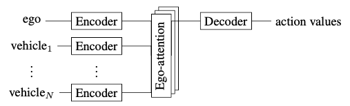
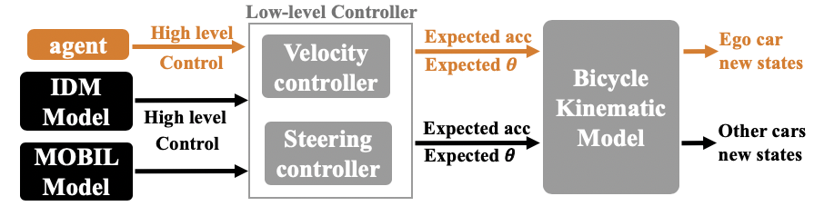
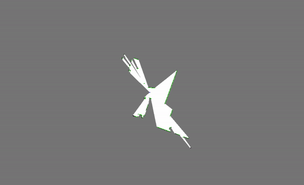
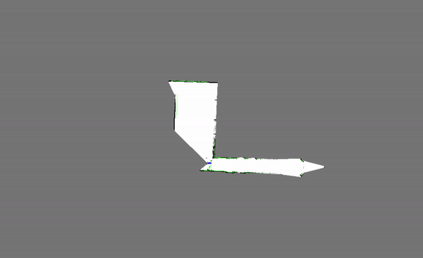

# Decision Making with Deep Q-network
We first explored the safe and comfortable decision making of AVs in dense traffic settings.

The proposed architecture uses a deep Q-network that can encode a varying number of vehicles, capture the ego-vechicle’s attentions paid to nearby vehicles, and evaluate actions at each time step to make the best decisions. 

We have tested the architecture in a Highway-Env simulation environment and observed a satisfying performance comparing to other basic DQN algorithm. During the simulation process, the road would be populated with several random vehicles and one ego vehicle. Ego vehicle takes in the high-level decisions from the agent, e.g. change to left lane, other vehicles’ behaviors are determined by Intelligent Driving Model and MOBIL model. The high-level decisions would then be converted into low-level controls: acceleration and head angle, which would be applied onto the vehicles simulated by the Kinematic Bicycle Model.

We showed that this architecture leads to more significant performance gains. We also visualized the attention matrix, which is generated from the proposed architecture, and captured the interaction features of dense traffic.

# Navigation with SLAM

We're given three datasets collected by IMU, odometry and Lidar sensors:

The goal is to get the trajectories of the robot and obtain corresponding maps of the test building.

 - The whole SLAM process can be divided into three parts: mapping, prediction and update. Before everything, note that we use particle:(position x, position y, orientation theta) to represent the current state. 
    - The mapping part transform the obstacles(wall-shaped) obtained from Lidar data into a map
    - The prediction part uses only odometry information to predict the next state. 
    - The update part combines the current map with particles(find correlation) and use that to update the particle weights.

Results:

